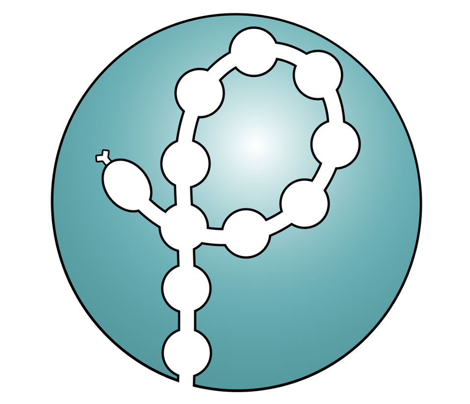

<p align="center">
  
</p>

# Polyply

Polyply is a Python suite designed to facilitate the generation of input files and
system coordinates for simulating (bio)macromolecules such as synthetic polymers or
polysaccharides.

Input files can be generated either from user-specified building blocks or by using the
polymers available in the library. The library currently includes polymer definitions for
the **GROMOS** (2016H66 & 53A6), **OPLS**, **Parmbsc1**, and **Martini** (2 & 3)
force-fields. Coordinates are generated by a multiscale random-walk protocol that is able
to generate condensed-phase systems at a target density, as well as more heterogeneous
systems such as aqueous two-phase systems. In addition, polyply allows you to tailor
initial chain conformations by providing a build file — for example, the persistence
length can be used to control the initial chain dimensions.

!!! tip "Where to start"
    - New to polyply? Read the [Installation](installation.md) guide, then the
      [Quick Start](quick-start.md).
    - Looking for a worked example? Browse the **Tutorials** (Martini polymers, GROMOS
      melts, PEGylated bilayers, single-stranded DNA, IDPs/proteins).
    - Writing your own parameters? See the [Syntax Reference](reference/build-file-syntax.md)
      and [Writing .ff Input Files](reference/writing-ff-input-files.md).

Always verify your results and give appropriate credit to the developers of the
force-field, molecule parameters, and this program.

## Citation

If you use polyply in your work, please cite:

```bibtex
@article{Grunewald2022Polyply,
  title={Polyply; a python suite for facilitating simulations of (bio-) macromolecules and nanomaterials},
  author={Gr{\"u}newald, Fabian and Alessandri, Riccardo and Kroon, Peter C and
          Monticelli, Luca and Souza, Paulo CT and Marrink, Siewert J},
  journal={Nature Communications},
  volume={13},
  pages={68},
  doi={https://doi.org/10.1038/s41467-021-27627-4},
  year={2022}
}
```

More details on the algorithm and its verification can be found in the
[publication](https://doi.org/10.1038/s41467-021-27627-4).

## Contributions & support

We are happy to accept submissions of polymer parameters to the polyply library — see
[Submit Polymer Parameters](contributing/submit-polymer-parameters.md). Code development
happens on [GitHub](https://github.com/marrink-lab/polyply_1.0); contributions are welcome
as [bug reports](https://github.com/marrink-lab/polyply_1.0/issues) and
[pull requests](https://github.com/marrink-lab/polyply_1.0/pulls). You can also reach out
on the [discussions board](https://github.com/marrink-lab/polyply_1.0/discussions).

## License

Polyply is distributed under the Apache 2.0 license. Copyright 2020 University of Groningen.
